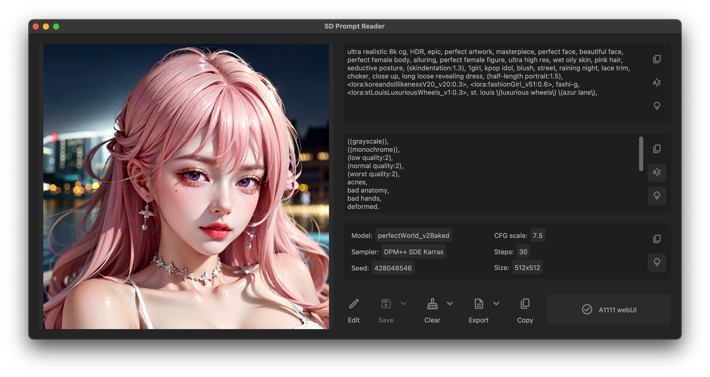
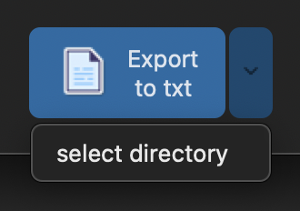
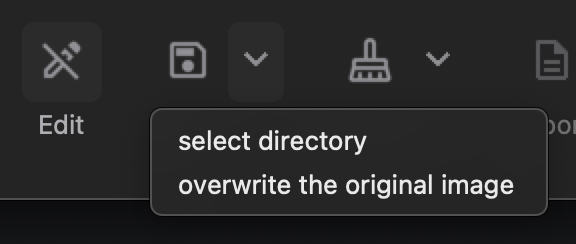

<div align="center">
    
    <h1>Stable Diffusion Prompt Reader</h1>
    <a href="https://github.com/receyuki/stable-diffusion-prompt-reader/releases/latest">
        </a>
    <a href="https://github.com/receyuki/stable-diffusion-prompt-reader/blob/master/LICENSE">
        </a>
    <a href="https://github.com/receyuki/stable-diffusion-prompt-reader/releases/latest">
        </a>
        
    <br><br>

[English](https://github.com/receyuki/stable-diffusion-prompt-reader/blob/master/README.md) | [简体中文](https://github.com/receyuki/stable-diffusion-prompt-reader/blob/master/README.zh-Hans.md)

一个独立的简易 AI 图片 prompt 查看器，用于在不依赖 webui 的情况下提取由 Stable Diffusion 生成图片内包含的 prompt
    <br>
    
</div>

## 功能
- 支持 macOS、 Windows 和 Linux
- 简单的拖放交互
- 复制 prompt 到剪贴板
- 去除图片中的 prompt
- 导出 prompt 到 txt 文件
- 编辑或导入 prompt 到图片
- 竖排显示以及根据字母排序
- 检测生成工具
- 支持多种格式
- 支持系统深色和浅色模式

## 支持格式
|                | PNG | JPEG | WEBP | TXT* |
|----------------|:---:|:----:|:----:|:----:|
| A1111's webUI  |  ✅  |  ✅   |  ✅   |  ✅   |
| Easy Diffusion |  ✅  |  ✅   |  ✅   |      |
| InvokeAI       |  ✅  |      |      |      |
| NovelAI        |  ✅  |      |      |      |
| ComfyUI*       |  ✅  |      |      |      |
| Naifu(4chan)   |  ✅  |      |      |      |

\* 见[格式限制](#TXT).

如果你使用的工具或格式不在这个列表中，请帮助我支持你的格式：将你的工具生成的原始图片文件压缩并上传到 issues，谢谢。

## 下载
### macOS 和 Windows 用户
从 [GitHub Releases](https://github.com/receyuki/stable-diffusion-prompt-reader/releases/latest) 下载可执行文件
### Linux 用户 (不定期测试)
~~我很确定 Linux 用户可以在没有可执行文件的情况下搞明白怎么用~~
1. 最低Python版本要求: 3.10
2. 确保你的 Python 中安装了 tkinter 包。
如果没有，请使用软件包管理器安装 python3-tk 包。  
e.g. `sudo apt-get install python3-tk` (基于 Debian 的发行版)
3. Clone repo
    ```bash
    git clone https://github.com/receyuki/stable-diffusion-prompt-reader.git
    ```
   或者直接下载 repo 为 zip 格式.
4. CD 到文件夹并安装依赖
    ```bash
    cd stable-diffusion-prompt-reader  
    pip install -r requirements.txt
    ```
5. Run
    ```bash
   python main.py
   ```

## 使用方式
### 读取 prompt
- 打开可执行文件 (.exe 或 .app) 并将图片拖入窗口.

或
- 右键图片选择使用SD Prompt Reader作为打开方式

或
- 直接将图片拖入可执行文件 (.exe 或 .app).

### 导出 prompt 到 txt 文件
- 点击 "Export" 将在图像文件旁生成一个txt文件.
- 要保存到另一个位置，点击展开的箭头并点击 "select directory".  


### 去除图片中的 prompt
- 点击 "Clear" 将在原图像文件旁生成一个后缀为"_data_removed"的图像文件.
- 要保存到另一个位置，点击展开的箭头并点击 "select directory".
- 要覆盖原始图像文件，点击展开的箭头并点击 "overwrite the original image".  


### 编辑图片
***请注意，编辑后的图片将以 A1111 格式进行写入，这意味着任何格式的图片在编辑后都将变为 A1111 格式.***
- 点击 "Edit" 进入编辑模式
- 直接在文本框中编辑 prompt，或者导入txt格式的prompt数据.
- 点击 "Save" 将在原图像文件旁生成一个后缀为"_edited"的编辑后图像文件.
- 要保存到另一个位置，点击展开的箭头并点击 "select directory".
- 要覆盖原始图像文件，点击展开的箭头并点击 "overwrite the original image".  


## 格式限制
### TXT
1. txt 文件仅能在编辑模式下导入.
2. 仅支持 A1111 格式的 txt 文件. 你可以使用 A1111 webui 生成的txt文件, 或使用 SD prompt reader 从 A1111 生成的图片中导出 txt.
### ComfyUI
***对comfyUI的支持需要更多测试。如果你认为你的图片不能正常显示，请将ComfyUI生成的原始文件以压缩文件的形式上传到issues.***
1. 如果设置框中有多组数据(seed, steps, CFG, etc.)，这意味着流程中有多个KSampler节点
2. 由于ComfyUI的特性，workflow中的所有节点和流程都存储在图像中，包括没有被使用的。并且一个流程可以有多个分支，多个输入和输出.
(e.g. 在一个流程中同时生成原图和hires. fix后的图像)
SD Prompt Reader 会遍历所有的流程和分支，并显示拥有完整的输入和输出的最长分支.
### Easy Diffusion
默认设置下, Easy Diffusion 不会将 prompt 写入图片. 请更改设置中的 _Metadata format_ 为 _embed_ 来写入 prompt 到图片中.

## 常见问题
### 病毒警告
错误的病毒警报是由我使用的打包工具 _pyinstaller_ 造成的, 这对 _pyinstaller_ 用户是一个常见的问题. 
我花费了许多时间来解决 Windows Defender 的错误警报, 但我没法对每个杀毒软件单独解决问题. 
因此, 你可以选择相信 Windows Defender 或者使用 Linux 用户的使用说明来使用 app.
### "SD Prompt Reader.app" 已损坏，无法打开。您应该将它移到废纸篓。
这是一个使用非 appstore 软件时常见的 macOS 问题, 开发者需要付给苹果每年 $99 来避免这个问题. 
你可以在设置中**隐私与安全性**的**安全性**中选择**允许任何来源**, 但这可能造成危险. 
我推荐的方式是移除 quarantine attributes.
1. 在应用程序中打开终端. 
2. 输入以下命令并按回车. 

    `xattr -r -d com.apple.quarantine app的路径`

    比如:

    `xattr -r -d com.apple.quarantine /Applications/SD\ Prompt\ Reader.app`

如果你仍然担心安全性可以选择使用 Linux 用户的使用说明来使用 app.

## 待办
- 图像批处理功能
- 多图像/文件夹模式

## Credits
- Inspired by [Stable Diffusion web UI](https://github.com/AUTOMATIC1111/stable-diffusion-webui/)
- App icon generated using Stable Diffusion with [IconsMI](https://huggingface.co/jvkape/IconsMI-AppIconsModelforSD)
- Special thanks to [Azusachan](https://github.com/Azusachan) for providing SD server
